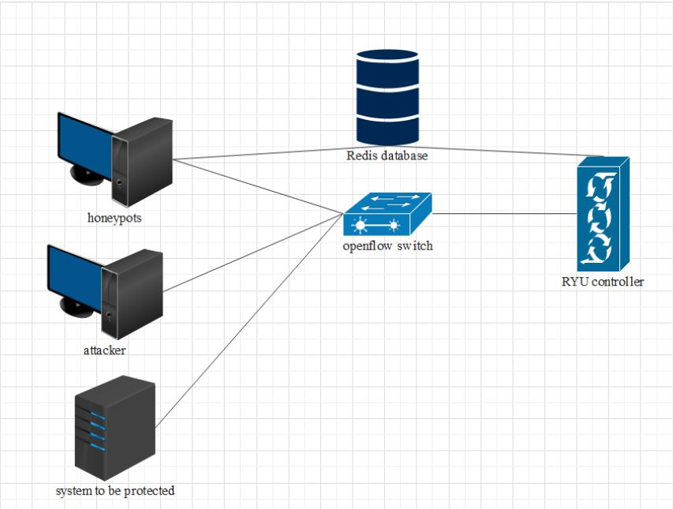
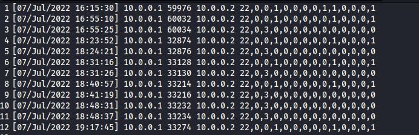
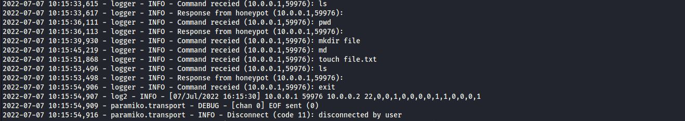

# Design:  

Intelligence HoneyPots on SDN:  
  

# HoneyPots:  
1. SSH:  
Secure shell protocol is a protocol to transfer data between two hosts in encrypted mode to protect the data from attackers.  
The Code of the SSH HP is written in python, the requried modules is:   
- **paramiko** using `pip install paramiko`  
- **logging** using `pip install logging`  
Before running SSH honeypot, a key must be generated using the following command:  
`ssh-keygen -t rsa -f server.key` and then rename the output file using `mv server.key.pub server.pub`  
After running the SSH honeypot **features.log** file will be created and file called **ssh_honeypot.log**, this file contain the logs about each connection to the honeypot.  
Exapmle of the **features.log** file:  
  
The file called **ssh_honeypot.log** has the every command The attacker write in the shell.  
To Run the SSH HoneyPot you should use `python3 SSH.py` and you should have the folder named **fake_files**.  
  
2. FTP:  
File Transfer Protocol is a protocol to transfer files between machines on the same network.  
The Code of the FTP HP is written in python, the requried modules is:  
- **pickle** using `pip install pickle-mixin`  
- **twisted** using `pip install Twisted`  
- **pyshark** using `pip install pyshark`  
After running FTP HP file named **ftplog.txt** will be created and it has the information about the each connection has occurred.  
Exapmle of the **ftplog.txt** file:  
  
To Run the FTP Honeypot you should use  
- `python3 ftppot.py`  
3. SMTP:  
Simple Mail Transfer Protocol is a protocol for transfer the mails from one machine to other using  telnet.  

# Zeek:  
You must install zeek using the following command:  
- `sudo apt-get -y install zeek`  
To run zeek then you must give it a pcap file so we used **tcpdump** tool to capture the traffic using:  
- `tcpdump -i <interface-name> -s 0 -w <filename>`, in this case the file name is **ntraffic.pcap**.  
After capturing the traffic, we will use zeek script called **extract.zeek**that extract some of the required features and store it in a file called **conn.list** using the following command:  
- `zeek -r ntraffic.pcap extract.zeek -C > conn.list`  
After getting **conn.list** file, we must sort it with the id of the connection using:  
- `sort -n conn.list > conn_sort.list`  
# Feature Extraction:  
The training Dataset for the model is KDD dataset which has 41 features.
Some of this features from the log files and some of them is from the traffic of the connections,
so we used zeek tool to extract some of the features and then link the features extracted from zeek and the log files using the pyhton program called **editor.py**.  
- You must have the file called **tablethree_editor.py** when running it.  
To Run the script we will use the following command:  
- `python3 editor.py`  
Files called **con_feature.txt** and **ips.txt** will be created that have the ssh,ftp, and the smtp connections only and the IPs.   
# Redis:  
To install redis server we will use the following commands:  
- ``  
- ``  
To install redis module for python we will use the following command:  
- `pip install redis`  
There is a python script to upload the files **con_feature.txt** and **ips.txt** for the ML model.  
We will use the python program called **store.py** to do that.  
To run the file that store data on the database we will use the following command:  
- `python3 store.py <ip-of-the-server-run-redis-server>`  
On the side of the ML model we will use **readfrom_db.py** to save the data on the machine.  
Two files called **con_feature.txt** and **ips.txt** will be created after running the script using:  
- `python3 readfrom_db`  
# Machine Learning model:  

