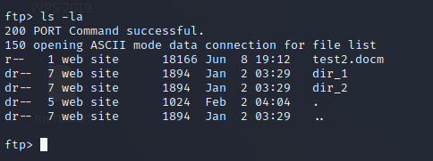

# Design:  
Intelligent HoneyPot on SDN:  
Our design is having 3 hosts, openflow switch,RYU controller and Redis server  
  
One of the hosts have the HoneyPots, capture the traffic, feature extraction and upload it to Redis server.  
The controller have the ML model and UI to show the actions have been taken.  
Hosts can be physical hosts if you are using openflow switch, in our case we are using mininet so it's a virtual hosts.  
# HoneyPots:  
*It exists on the Host*  
1. SSH:  
Secure shell protocol is a protocol to transfer data between two hosts in encrypted mode to protect the data from attackers.  
The Code of the SSH HP is written in python, the requried modules is:   
- **paramiko** using `pip install paramiko`  
- **logging** using `pip install logging`  
Before running SSH honeypot, a key must be generated using the following command:  
`ssh-keygen -t rsa -f server.key` and then rename the output file using `mv server.key.pub server.pub`  
After running the SSH honeypot **features.log** file will be created and file called **ssh_honeypot.log**, this file contain the logs about each connection to the honeypot.  
Exapmle of the **features.log** file:  
  
The file called **ssh_honeypot.log** has the every command The attacker write in the shell.  
To Run the SSH HoneyPot you should use `python3 SSH.py` and you should have the folder named **fake_files**.  
  
<h1>FTP Honeypot</h1> 
File Transfer Protocol is a protocol to transfer files between machines on the same network.
This honeypot simulates the FTP service from the server side. It simulates both a legitimate user session that connects using a username and a password and also it simulates a guest session i.e anonymous session.

The Code of the FTP HoneyPot is written in python. 
<h2>The Required Modules</h2>

- **pickle** using `pip install pickle-mixin`  
- **twisted** using `pip install Twisted`  
- **pyshark** using `pip install pyshark`  
 
<h2>The Log file</h2>
After running FTP HoneyPot file named **ftplog.txt** will be created and it has the information about the each connection has occurred.  
Exapmle of the **ftplog.txt** file:  
  
 It is in CSV format as each connection represents a line in the file where each line .i.e connection consists of a set of comma separated features  these are a subset of the NSL-KDD dataset Features.
 
<h2>To Run the FTP Honeypot: </h2> you should use  
- `python3 ftppot.py`  
 
<h2>Commands Supported by the FTP Honeypot:</h2>
<ol>

  <li><b>Help:</b>  Help command is used to show the available commands that are supported on the FTP server.

 
 </li>
  

  <li><b>FEAT:</b> An alternative command to HELP to show the available features.
  
  </li>
</li>
  <li><b>LS:</b> A Command used to list the content of the current working directory excluding the hidden ones.
   
  </li>
    <li><b>LS -la:</b> A Command used to list the content of the current working directory including all hidden files and subdirectories.
  </li>
     <li><b>MKDIR:</b> A command used to make a new directory.
  </li>
  <li><b>CWD:</b> A command used to change the current working directory .i.e to navigate to another one.</li>
   <li><b>PWD:</b> A command used to print the current working directory.</li>
   <li><b>PUT:</b> A command used to upload files to the server.</li>
   <li><b>PUT:</b> A command used to upload files to the server. <b>Note: </b> we simulated the case of uploading hidden files too.</li>
   <li><b>CHMOD:</b> A command used to change the permissions of a file. This command needs root privileges.</li>
   <li><b>SU or ROOT:</b> A command used to change to root privileges.</li>
   <li><b>ASCII:</b> A command used to switch to ASCII mode to transfer files.</li>
   <li><b>BINARY:</b> A command used to switch to BINARY mode to transfer files.</li>
   <li><b>GET:</b> A command used to Download files from the ftp server.</li>
   <li><b>QUIT:</b> A command used to end the session and disconnect from the FTP server.</li>
   <li><b>BYE:</b> An alternative command to the Quit command.</li>
  
  
</ol> 
3. SMTP:  
Simple Mail Transfer Protocol is a protocol for transfer the mails from one machine to other using  telnet.  

# Zeek:  
*It exists on the Host*  
You must install zeek using the following command:  
- `sudo apt-get -y install zeek`  
To run zeek then you must give it a pcap file so we used **tcpdump** tool to capture the traffic using:  
- `tcpdump -i <interface-name> -s 0 -w <filename>`, in this case the file name is **ntraffic.pcap**.  
After capturing the traffic, we will use zeek script called **extract.zeek**that extract some of the required features and store it in a file called **conn.list** using the following command:  
- `zeek -r ntraffic.pcap extract.zeek -C > conn.list`  
After getting **conn.list** file, we must sort it with the id of the connection using:  
- `sort -n conn.list > conn_sort.list`  
Exapmle of the **conn_sort.list** file:  
 
# Feature Extraction:  
*It exists on the Host*  
The training Dataset for the model is KDD dataset which has 41 features.
Some of this features from the log files and some of them is from the traffic of the connections,
so we used zeek tool to extract some of the features and then link the features extracted from zeek and the log files using the pyhton program called **editor.py**.  
- You must have the file called **tablethree_editor.py** when running it.  
To Run the script we will use the following command:  
- `python3 editor.py`  
Files called **con_feature.txt** and **ips.txt** will be created that have the ssh,ftp, and the smtp connections only and the IPs.  

# Redis:  
*It exists on the Host and the controller*  
To install redis server we will use the following commands:  
- `curl -fsSL https://packages.redis.io/gpg | sudo gpg --dearmor -o /usr/share/keyrings/redis-archive-keyring.gpg`  
- `echo "deb [signed-by=/usr/share/keyrings/redis-archive-keyring.gpg] https://packages.redis.io/deb $(lsb_release -cs) main" | sudo tee /etc/apt/sources.list.d/redis.list`  
- `sudo apt-get update`
- `sudo apt-get install redis`  
To install redis module for python we will use the following command:  
- `pip install redis`  
To run redis server on your host:  
- `redis-server --protected-mode no`  

There is a python script to upload the files **con_feature.txt** and **ips.txt** for the ML model.  
We will use the python program called **store.py** to do that.  
To run the file that store data on the database we will use the following command:  
- `python3 store.py <ip-of-the-server-run-redis-server>`  
On the side of the ML model we will use **readfrom_db.py** to save the data on the machine.  
Two files called **con_feature.txt** and **ips.txt** will be created after running the script using:  
- `python3 readfrom_db`  

# Mininet:  
*It exists on the Host*  
To install mininet on your machine, you can use the following command:  
- `sudo apt-get -y install mininet`  
To use mininet, you can type:  
- `service openvswitch-switch start` to start the openflow switch.  
- `sudo mn --controller=remote,ip=127.0.0.1 --switch=ovsk,protcols=OpenFlow13 --topo=minimal` to start the mininet with **minimal** topology with 2 hosts and remote controller.  
Inside the mininet, you can type `xterm h1` to get a terminal for host1.  
We used a custom topology written in python, to run the topology:  
- `sudo python3 topo.py`  
You will get 3 hosts with mac addresses and IPs, and NAT so we can connect to the internet.  

# Controller:  
To install RYU controller:  
- `git clone https://github.com/faucetsdn/ryu.git` to clone the repo have the ryu controller.  
- `cd ryu`
- `sudo pip install -r tools/pip-requires` to install the requried modules
- `sudo python3 setup.py install`  
Now you have the ryu controller with all the Applications of it. After download  the **simple_switch_13.py** you will change directory to where the file exist and run the Applications using:  
- `ryu-manager --verbose simple_switch_13`  

# Machine Learning model:  
*It exists on the contoller*  
To run the ML model, you must have the following modules:  
- numpy, you can install it using `pip install numpy`
- pandas, you can install it using `pip install pandas`
- sklearn, you can install it using `pip install sklearn`
- keras, you can install it using `pip install keras`  
You must have **kdd_train.csv**, and **kdd_test.csv** in the same folder where you will run the model.  
You can run the model using:  
- `python3 Model.py`  
After that you can predict using the **classifier.py** but you must have the following modules:  
- tensorflow, you can install using `pip install tensorflow`  
Now you can run the classifier using:
- `python3 classifier.py`  

# UI:  
*It exists on the contoller*  
You must have the following modules:  
- pyqt6, you can install it using `pip install pyqt6`.  
Now you can run the UI using:
- `python3 main.py`  
There is optional info inside the file called "global_var.py" you will find different variable with explicit names.  
Exapmle of the UI:  
 
